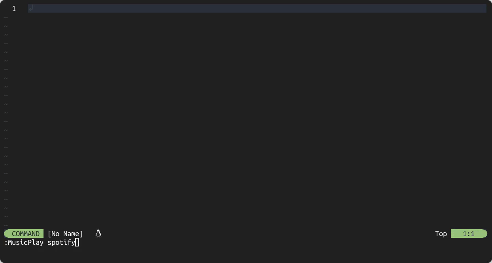

# Music Controls

Control your favorite music players with ease from within Neovim.



## Description

Music Controls is a Neovim plugin that allows you to easily control your favorite
music players from within Neovim. The plugin basically acts as a wrapper around
`playerctl`, a command-line utility that can control media players.
This makes almost any music player compatible with Music Controls, ranging from
Spotify to VLC, etc.

I created Music Controls to make it more convenient and efficient to control my
music player while working within Neovim. Instead of constantly switching workspaces
or opening a terminal to control my music player, I can use this plugin to do it
all within Neovim. You might say that I'm lazy, some say I'm not 😉!

I hope that others who have similar needs will find Music Controls useful as well.

## Installation

This example uses [lazy.nvim](https://github.com/folke/lazy.nvim) to install/load
the plugin. Other plugin managers can be used as well.

```lua
{
  'AntonVanAssche/music-controls.nvim',
  dependencies = { 'rcarriga/nvim-notify' }
}
```

### Dependencies

Music Controls requires `playerctl`  to be installed in order to work properly.

## Configuration

Optionally, you can specify a default music player by adding the following code
to your `init.lua` file:

```lua
{
  'AntonVanAssche/music-controls.nvim',
  dependencies = { 'rcarriga/nvim-notify' },
  opts = {
    default_player = 'spotify'
  }
}
```

The example above sets Spotify as the default music player.
If you don't specify a default player, Music Controls requires you to specify a player.
Refer to the [commands](#commands) section for more information.

## Commands

For more information, refer to the documentation by typing `:h MusicControls`.

### `MusicCurrent`

- **Description**: Displays the current song playing.
  - **Player**: The music player to use (optional).
- **Usage**: `:MusicCurrent [player]`
- **Example**: `:MusicCurrent spotify`

### `MusicListPlayers`

- **Description**: Displays a list of available music players.
- **Usage**: `:MusicListPlayers`
- **Example**: `:MusicListPlayers`

### `MusicLoop`

- **Description**: Set a loop mode for the current music player.
- **Usage**: `:MusicLoop [player] [mode]`
  - **Player**: The music player to use (optional).
  - **Mode**:
    - `Track` (Default)
    - `None`
    - `Playlist`
- **Example**: `:MusicLoop spotify Playlist`

### `MusicNext`

- **Description**: Play the next song.
- **Usage**: `:MusicNext [player] [amount]`
  - **Player**: The music player to use (optional).
  - **Amount**: The number of songs to skip (optional).
    - **Default**: 1
- **Example**: `:MusicNext spotify 2`

### `MusicPause`

- **Description**: Pause the current song.
- **Usage**: `:MusicPause [player]`
  - **Player**: The music player to use (optional).
- **Example**: `:MusicPause spotify`

### `MusicPlay`

- **Description**: Toggle play/pause the current song.
- **Usage**: `:MusicPlay [player]`
  - **Player**: The music player to use (optional).
- **Example**: `:MusicPlay spotify`

### `MusicPrevious`

- **Description**: Play the previous song.
- **Usage**: `:MusicPrevious [player] [amount]`
  - **Player**: The music player to use (optional).
  - **Amount**: The number of songs to skip (optional).
    - **Default**: 1
- **Example**: `:MusicPrevious spotify 2`

### `MusicShuffle`

- **Description**: Toggle shuffle mode for the current music player.
- **Usage**: `:MusicShuffle [player]`
  - **Player**: The music player to use (optional).
- **Example**: `:MusicShuffle spotify`

## License

Music Controls is licensed under the MIT License. See the [LICENSE.md](./LICENSE.md)
file for more information.

## Contributing

Contributions are welcome! Please feel free to submit a pull request or open an issue
for any bugs or feature requests.
