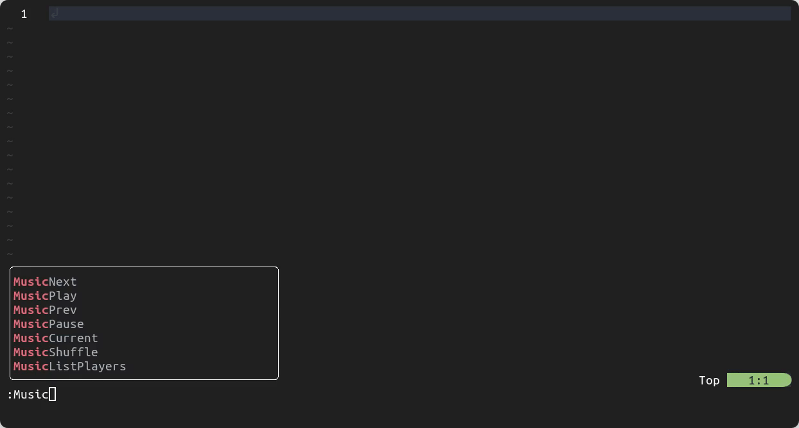

# Music Controls

Control your favorite music players with ease from within Neovim.



## Description

Music Controls is a Neovim plugin that allows you to easily control your favorite music players from within Neovim.
The plugin uses `playerctl` to control the music players, so it is required that `playerctl` is installed on your system in order to use the plugin.
Additionally, the music players you want to control (such as Spotify, VLC, etc.) must also be installed on your system.

I created Music Controls to make it more convenient and efficient to control my music player while working within Neovim.
Instead of constantly switching workspaces or opening a terminal to control my music player, I can use this plugin to do it all within Neovim.
You might say that I'm lazy, some say I'm not 😉!

I hope that others who have similar needs will find Music Controls useful as well.

## Installation

### Dependencies

Music Controls requires `playerctl`  to be installed in order to work properly.

### Using [lazy.nvim](https://github.com/folke/lazy.nvim)

```lua
{
  'AntonVanAssche/music-controls.nvim',
  dependencies = { 'rcarriga/nvim-notify' }
}
```

### Usage

Once the plugin is installed, you can use the following commands followed by the player of your choice from within Neovim.

-   `:MusicPlay` - Play the current track.
-   `:MusicPause` - Pause the current track.
-   `:MusicNext` - Skip to the next track.
-   `:MusicPrev` - Go back to the previous track.
-   `:MusicCurrent` - Display the current track.
-   `:MusicShuffle` - Toggle shuffle mode.
-   `:MusicLoop` - Toggle repeat mode, or set a specify mode.
-   `:MusicListPlayers` - List all players available to control.

#### Examples

Here are some examples of how you can use the commands mentioned above:

```
:MusicPlay spotify          # Toggle play/pause.
:MusicNext spotify          # Skip to the next track.
:MusicPrev spotify 4        # Skip the 4 next tracks.
:MusicPause spotify         # Pause the current track.
:MusicListPlayers           # List all players currently available.
:MusicLoop Track            # Keep repeating the current track.
:MusicLoop                  # Set the repeat mode to None or Track, depending on the current mode.
:MusicShuffle spotify       # Toggle shuffle mode.
```

#### Specifying a Default Player

Optionally, you can specify a default music player by adding the following code to your `init.lua` file:

```lua
{
  'AntonVanAssche/music-controls.nvim',
  dependencies = { 'rcarriga/nvim-notify' },
  opts = {
    default_player = 'spotify'
  }
}
```

This will set Spotify as the default music player for Music Controls. You can substitute `spotify` with the name of any other music player you want to set as the default.

With a default player set, you can use Music Controls commands without specifying a player each time.
For example, `:MusicPlay` will automatically use the default player instead of requiring you to enter `:MusicPlay spotify`.
After setting a default player, you can still control all other players by specifying it as an argument.

For more information, refer to the documentation by typing `:h MusicControls`.

## License

Music Controls is licensed under the MIT License. See the [LICENSE.md](./LICENSE.md) file for more information.

## Contributing

Contributions are welcome! Please feel free to submit a pull request or open an issue for any bugs or feature requests.
